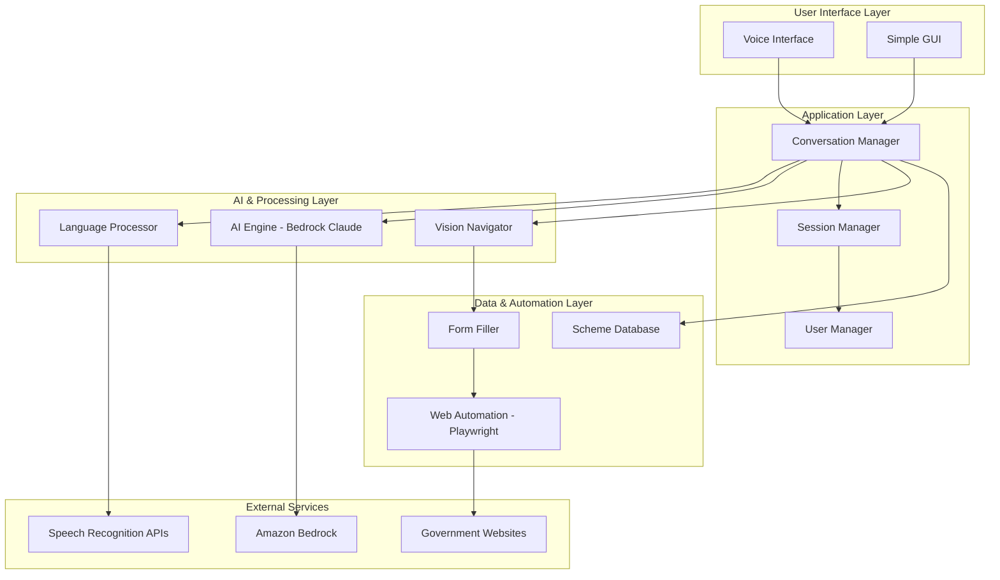

# Design Document: Gramin Sahayak AI

## Overview

Gramin Sahayak AI is a voice-activated assistant system designed to help rural Indian citizens discover and apply for government schemes. The system combines Amazon Bedrock's Claude 3.5 Sonnet for intelligent conversation, computer vision for dynamic form navigation, and multilingual voice processing for Bengali and Hindi support.

The architecture follows a modular design with clear separation between voice processing, AI intelligence, web automation, and user interface components. The system prioritizes accessibility, reliability, and ease of use for users with limited digital literacy.

## Architecture

The system follows a layered architecture with the following main components:



## Components and Interfaces

### Voice Interface Component

**Purpose**: Handles speech recognition and text-to-speech for Bengali and Hindi languages.

**Key Classes**:
- `VoiceProcessor`: Main interface for voice operations
- `SpeechRecognizer`: Converts speech to text using specialized models
- `TextToSpeech`: Converts text responses to speech
- `LanguageDetector`: Identifies user's preferred language

**Technologies**:
- BanglaSpeech2Text library for Bengali speech recognition
- Wav2Vec2-Large-XLSR-53 model for Hindi speech recognition
- AI4Bharat Indic-TTS for text-to-speech in both languages
- PyAudio for audio input/output handling

**Interface**:
```python
class VoiceProcessor:
    def recognize_speech(self, audio_data: bytes, language: str) -> str
    def synthesize_speech(self, text: str, language: str) -> bytes
    def detect_language(self, audio_data: bytes) -> str
    def set_noise_reduction(self, enabled: bool) -> None
```

### AI Engine Component

**Purpose**: Provides intelligent conversation and decision-making using Amazon Bedrock Claude 3.5 Sonnet.

**Key Classes**:
- `BedrockClient`: Manages connections to Amazon Bedrock
- `ConversationEngine`: Handles dialogue flow and context
- `SchemeRecommender`: Matches user needs with relevant schemes
- `ResponseGenerator`: Creates contextually appropriate responses

**Technologies**:
- Amazon Bedrock Runtime API
- boto3 AWS SDK for Python
- Claude 3.5 Sonnet model (anthropic.claude-3-5-sonnet-20240620-v1:0)

**Interface**:
```python
class AIEngine:
    def process_query(self, user_input: str, context: dict) -> str
    def recommend_schemes(self, user_profile: dict) -> List[Scheme]
    def generate_response(self, intent: str, data: dict, language: str) -> str
    def maintain_context(self, session_id: str, interaction: dict) -> None
```

### Vision Navigator Component

**Purpose**: Uses computer vision to identify and interact with form fields dynamically.

**Key Classes**:
- `FormAnalyzer`: Analyzes web pages to identify form elements
- `FieldDetector`: Identifies specific input fields using visual cues
- `ElementClassifier`: Determines field types (text, dropdown, checkbox, etc.)
- `LayoutAdapter`: Adapts to different form layouts

**Technologies**:
- OpenCV for image processing
- Tesseract OCR for text recognition in form labels
- Playwright's screenshot capabilities
- Custom ML models for form element detection

**Interface**:
```python
class VisionNavigator:
    def analyze_page(self, page_screenshot: bytes) -> FormStructure
    def identify_fields(self, form_structure: FormStructure) -> List[FormField]
    def classify_field_type(self, field_image: bytes) -> FieldType
    def find_field_by_label(self, label: str, form_structure: FormStructure) -> FormField
```

### Web Automation Component

**Purpose**: Handles reliable web automation using Playwright for government website interactions.

**Key Classes**:
- `BrowserManager`: Manages browser instances and sessions
- `NavigationController`: Handles page navigation and loading
- `FormInteractor`: Fills forms and submits applications
- `ErrorHandler`: Manages automation failures and retries

**Technologies**:
- Playwright Python for web automation
- Chromium browser engine for consistency
- Custom retry mechanisms for unreliable government websites

**Interface**:
```python
class WebAutomation:
    def navigate_to_scheme(self, scheme_url: str) -> Page
    def fill_form_field(self, field: FormField, value: str) -> bool
    def submit_application(self, confirmation_required: bool) -> SubmissionResult
    def handle_captcha(self, page: Page) -> CaptchaResult
```

### Language Processor Component

**Purpose**: Handles translation, localization, and language-specific processing.

**Key Classes**:
- `Translator`: Translates between English, Bengali, and Hindi
- `LocalizationManager`: Manages language-specific content
- `TerminologyManager`: Handles government terminology translation
- `SimplificationEngine`: Converts complex terms to simple language

**Interface**:
```python
class LanguageProcessor:
    def translate_text(self, text: str, source_lang: str, target_lang: str) -> str
    def simplify_language(self, text: str, language: str) -> str
    def localize_scheme_info(self, scheme: Scheme, language: str) -> LocalizedScheme
    def preserve_official_terms(self, text: str, language: str) -> str
```

## Data Models

### User Profile Model
```python
@dataclass
class UserProfile:
    user_id: str
    name: str
    age: int
    gender: str
    location: Location
    occupation: str
    income_level: str
    family_size: int
    preferred_language: str
    disabilities: List[str]
    created_at: datetime
    updated_at: datetime
```

### Government Scheme Model
```python
@dataclass
class GovernmentScheme:
    scheme_id: str
    name: str
    description: str
    eligibility_criteria: List[str]
    required_documents: List[str]
    application_url: str
    deadline: Optional[datetime]
    benefits: str
    category: str
    target_demographics: List[str]
    state_specific: bool
    last_updated: datetime
```

### Form Field Model
```python
@dataclass
class FormField:
    field_id: str
    field_type: FieldType
    label: str
    coordinates: Tuple[int, int, int, int]  # x, y, width, height
    required: bool
    validation_rules: List[str]
    placeholder_text: Optional[str]
    options: Optional[List[str]]  # for dropdowns/radio buttons
```

### Session Model
```python
@dataclass
class UserSession:
    session_id: str
    user_id: str
    start_time: datetime
    last_activity: datetime
    conversation_history: List[Interaction]
    current_scheme: Optional[GovernmentScheme]
    form_progress: Optional[FormProgress]
    language: str
    context: dict
```

## Correctness Properties

*A property is a characteristic or behavior that should hold true across all valid executions of a system-essentially, a formal statement about what the system should do. Properties serve as the bridge between human-readable specifications and machine-verifiable correctness guarantees.*

Now I need to analyze the acceptance criteria to determine which ones can be tested as properties. Let me use the prework tool:

<function_calls>
<invoke name="prework">
<parameter name="featureName">gramin-sahayak-ai

### Property 1: Multilingual Speech Recognition Accuracy
*For any* audio input in Bengali or Hindi, the Voice_Interface should achieve recognition accuracy above 85% threshold when background noise is below moderate levels
**Validates: Requirements 1.1, 1.2**

### Property 2: Text-to-Speech Conversion Completeness
*For any* text response in the user's preferred language (Bengali or Hindi), the Voice_Interface should successfully convert it to audible speech without data loss
**Validates: Requirements 1.3**

### Property 3: Noise Filtering Effectiveness
*For any* speech input with background noise, the Voice_Interface should filter noise and maintain recognition accuracy within 10% of clean audio performance
**Validates: Requirements 1.4**

### Property 4: Speech Recognition Error Recovery
*For any* speech recognition failure, the Voice_Interface should prompt the user for repetition and provide clear guidance in their preferred language
**Validates: Requirements 1.5**

### Property 5: Scheme Relevance Matching
*For any* user query describing needs or situation, the Scheme_Database should return schemes where at least 80% match the user's eligibility criteria
**Validates: Requirements 2.1**

### Property 6: Complete Language Translation
*For any* system response or scheme information, the Language_Processor should translate all content to the user's preferred language while preserving official terminology
**Validates: Requirements 2.2, 5.1, 5.2, 5.3**

### Property 7: Language Simplification Consistency
*For any* complex eligibility criteria or technical terms, the Language_Processor should provide simplified explanations using vocabulary appropriate for users with limited digital literacy
**Validates: Requirements 2.3, 5.4**

### Property 8: Scheme Prioritization Logic
*For any* set of multiple relevant schemes, the Gramin_Sahayak should order them by relevance score and application deadline proximity
**Validates: Requirements 2.4**

### Property 9: Timestamp Information Completeness
*For any* scheme information displayed, the Scheme_Database should include the last update timestamp
**Validates: Requirements 2.5**

### Property 10: Comprehensive Form Analysis
*For any* government application form, the Vision_Navigator should identify all input fields, classify their types (text, dropdown, checkbox, radio), and distinguish between similar fields using context
**Validates: Requirements 3.1, 3.5, 3.3**

### Property 11: Form Layout Adaptability
*For any* changes to form layouts, the Vision_Navigator should maintain field detection capability without requiring code updates
**Validates: Requirements 3.2**

### Property 12: Vision Navigation Error Handling
*For any* form field that cannot be identified visually, the Vision_Navigator should request user guidance and provide clear instructions
**Validates: Requirements 3.4**

### Property 13: User Confirmation Requirement
*For any* form field filling operation, the Form_Filler should request and receive user confirmation before entering data
**Validates: Requirements 4.1**

### Property 14: Data Validation Completeness
*For any* user data entered into form fields, the Form_Filler should validate it against all field requirements and reject invalid inputs
**Validates: Requirements 4.2**

### Property 15: Required Field Detection
*For any* form with required fields, the Form_Filler should identify missing information and prompt the user for necessary data
**Validates: Requirements 4.3**

### Property 16: Pre-submission Review Process
*For any* completed form ready for submission, the Form_Filler should review all entered data with the user before proceeding
**Validates: Requirements 4.4**

### Property 17: Form Error Explanation Quality
*For any* error occurring during form filling, the Form_Filler should explain the error in simple language and suggest specific corrections
**Validates: Requirements 4.5**

### Property 18: Context Preservation During Language Switch
*For any* language change during an active session, the Language_Processor should maintain conversation context and continue seamlessly in the new language
**Validates: Requirements 5.5**

### Property 19: Secure Data Storage
*For any* personal information provided by users, the Gramin_Sahayak should store it with encryption and require authentication for access
**Validates: Requirements 6.1, 6.5**

### Property 20: Auto-population Functionality
*For any* form field that matches previously stored user information, the Gramin_Sahayak should offer to auto-populate the field with the stored data
**Validates: Requirements 6.2**

### Property 21: Complete Data Deletion
*For any* user request for data deletion, the Gramin_Sahayak should remove all stored personal information from all storage locations
**Validates: Requirements 6.4**

### Property 22: User-Friendly Error Guidance
*For any* user error or confusion, the Gramin_Sahayak should provide clear, patient guidance without technical jargon
**Validates: Requirements 7.1**

### Property 23: Process Explanation Simplicity
*For any* complex process explanation, the Gramin_Sahayak should use simple language and familiar analogies appropriate for rural users
**Validates: Requirements 7.2**

### Property 24: Sequential Option Presentation
*For any* scenario with multiple options, the Gramin_Sahayak should present them one at a time to avoid overwhelming users
**Validates: Requirements 7.3**

### Property 25: Task Completion Reinforcement
*For any* successfully completed task, the Gramin_Sahayak should provide positive reinforcement and clear guidance for next steps
**Validates: Requirements 7.5**

### Property 26: Bedrock Integration Consistency
*For any* user query processing, response generation, or scheme analysis, the Gramin_Sahayak should use Amazon Bedrock Claude 3.5 Sonnet as the primary AI engine
**Validates: Requirements 8.1, 8.2, 8.3**

### Property 27: AI Service Fallback Behavior
*For any* Amazon Bedrock API failure, the Gramin_Sahayak should gracefully degrade to simpler response mechanisms while maintaining basic functionality
**Validates: Requirements 8.4**

### Property 28: API Cost Optimization
*For any* interaction with Bedrock services, the Gramin_Sahayak should optimize API calls to minimize costs while maintaining response quality
**Validates: Requirements 8.5**

### Property 29: Playwright Web Automation Consistency
*For any* government website interaction, the Gramin_Sahayak should use Playwright for reliable web automation
**Validates: Requirements 9.1**

### Property 30: Adaptive Loading Behavior
*For any* slow-loading government website, the Gramin_Sahayak should wait appropriately for elements to become available before proceeding
**Validates: Requirements 9.2**

### Property 31: Security Measure Handling
*For any* CAPTCHA or security measure encountered, the Gramin_Sahayak should notify the user and provide clear guidance for manual completion
**Validates: Requirements 9.3**

### Property 32: Website Structure Adaptation
*For any* changes to government website structures, the Gramin_Sahayak should attempt to adapt using vision-based navigation before requesting user assistance
**Validates: Requirements 9.4**

### Property 33: Automation Failure Recovery
*For any* web automation failure, the Gramin_Sahayak should provide manual guidance to help users complete the process independently
**Validates: Requirements 9.5**

### Property 34: Network Resilience
*For any* poor network connectivity situation, the Gramin_Sahayak should retry operations appropriately and inform users of connection issues with suggested solutions
**Validates: Requirements 10.1**

### Property 35: Website Unavailability Handling
*For any* unavailable government website, the Gramin_Sahayak should suggest alternative application times or methods
**Validates: Requirements 10.2**

### Property 36: Voice Recognition Fallback
*For any* repeated voice recognition failures, the Gramin_Sahayak should offer alternative input methods or simplified voice commands
**Validates: Requirements 10.3**

### Property 37: Form Submission Recovery
*For any* failed form submission, the Gramin_Sahayak should preserve all entered data and guide users through retry attempts
**Validates: Requirements 10.4**

### Property 38: Critical Error Management
*For any* critical system error, the Gramin_Sahayak should log the error for system improvement while providing helpful user guidance
**Validates: Requirements 10.5**

## Error Handling

The system implements comprehensive error handling across all components:

**Voice Processing Errors**:
- Speech recognition failures trigger retry mechanisms with user guidance
- Audio quality issues prompt users to adjust their environment
- Language detection errors default to user's previously selected language

**AI Service Errors**:
- Bedrock API failures activate fallback response generation
- Network timeouts trigger retry logic with exponential backoff
- Rate limiting errors queue requests and inform users of delays

**Web Automation Errors**:
- Page loading failures retry with different strategies
- Element detection failures fall back to vision-based navigation
- Form submission errors preserve data and guide manual completion

**Data Management Errors**:
- Database connection failures use local caching where possible
- Encryption/decryption errors trigger secure data recovery procedures
- Authentication failures provide clear guidance for resolution

## Testing Strategy

The testing approach combines unit testing for specific scenarios with property-based testing for comprehensive coverage:

**Unit Testing Focus**:
- Specific examples of successful voice recognition in both languages
- Integration points between AI engine and external services
- Edge cases like empty forms, network timeouts, and malformed data
- Error conditions and recovery mechanisms
- User interface interactions and accessibility features

**Property-Based Testing Configuration**:
- Uses Hypothesis library for Python property-based testing
- Minimum 100 iterations per property test to ensure statistical confidence
- Each property test references its corresponding design document property
- Tag format: **Feature: gramin-sahayak-ai, Property {number}: {property_text}**
- Custom generators for:
  - Bengali and Hindi text samples
  - Government form structures
  - User profile variations
  - Network condition simulations
  - Audio samples with varying noise levels

**Testing Libraries and Tools**:
- pytest for unit testing framework
- Hypothesis for property-based testing
- pytest-playwright for web automation testing
- pytest-mock for service mocking
- coverage.py for test coverage analysis

**Test Data Management**:
- Synthetic government scheme database for testing
- Anonymized user profiles for testing personalization
- Mock government websites for form testing
- Audio samples in Bengali and Hindi for voice testing
- Network simulation tools for connectivity testing

The dual testing approach ensures both concrete functionality validation through unit tests and comprehensive correctness verification through property-based tests, providing confidence in the system's reliability for rural users with varying technical capabilities.